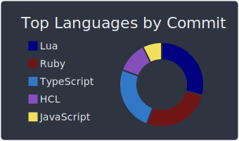

## 👤 About Me
[](https://www.linkedin.com/in/denizgokcin-478911117/)
[](mailto:dgokcin@gmail.com)
[](https://bitbucket.org/dgokcin/)
[](https://hub.docker.com/u/denizgokcin)

## 🛠️ Technologies & Tools


## 📊 Weekly Stats
<!--START_SECTION:waka-->

```text
From: 13 October 2022 - To: 20 October 2022

YAML         10 hrs 29 mins  ████████████████████▓░░░░   83.13 %
Other        58 mins         ██░░░░░░░░░░░░░░░░░░░░░░░   07.78 %
```

<!--END_SECTION:waka-->

## 📈 GitHub Stats
[](https://github.com/dgokcin/dgokcin/tree/master/profile-summary-card-output)
[](https://github.com/dgokcin/dgokcin/tree/master/profile-summary-card-output)
[](https://github.com/dgokcin/dgokcin/tree/master/profile-summary-card-output)
[](https://github.com/dgokcin/dgokcin/tree/master/profile-summary-card-output)
