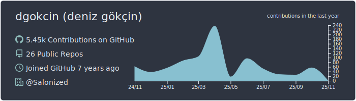
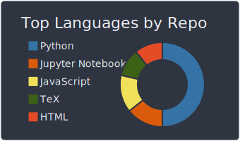

## 👤 About Me
[](https://www.linkedin.com/in/denizgokcin-478911117/)
[](mailto:dgokcin@gmail.com)
[](https://bitbucket.org/dgokcin/)
[](https://hub.docker.com/u/denizgokcin)

## 🛠️ Technologies & Tools


## 📊 Weekly Stats
<!--START_SECTION:waka-->
```text
Week: 29 December, 2020 - 05 January, 2021

Other      4 hrs 13 mins   █████████████▒░░░░░░░░░░░   53.36 % 
Docker     1 hr 1 min      ███▒░░░░░░░░░░░░░░░░░░░░░   13.03 % 
YAML       49 mins         ██▓░░░░░░░░░░░░░░░░░░░░░░   10.38 % 
TeX        45 mins         ██▒░░░░░░░░░░░░░░░░░░░░░░   09.61 % 
Markdown   25 mins         █▒░░░░░░░░░░░░░░░░░░░░░░░   05.28 % 
```
<!--END_SECTION:waka-->

## 📈 GitHub Stats
[](https://github.com/dgokcin/dgokcin/tree/master/profile-summary-card-output)
[](https://github.com/dgokcin/dgokcin/tree/master/profile-summary-card-output)
[](https://github.com/dgokcin/dgokcin/tree/master/profile-summary-card-output)
[](https://github.com/dgokcin/dgokcin/tree/master/profile-summary-card-output)
